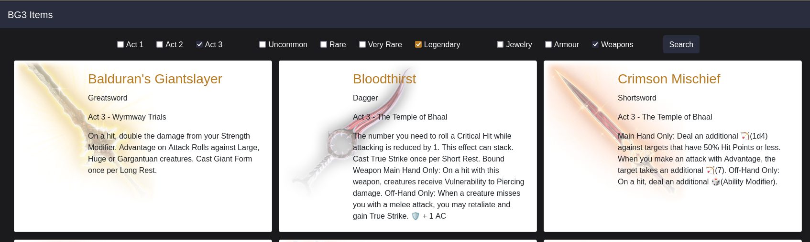

# BG3 Item Viewer

The original data was pulled from the [Google Sheet](https://docs.google.com/spreadsheets/d/152UzjrGGHZWi_2fZ33mWdgQMRKzMMgV6iLfKVprvFJ8/edit#gid=1997487230) provided by [Reddit User EgonThyPickle](https://www.reddit.com/user/EgonThyPickle/) via this [post](https://www.reddit.com/r/BaldursGate3/comments/17qhpx6/bg3_item_checklist/)

The image URLs are all scraped from the [BG3 Wiki](https://bg3.wiki/)

If you want just the JSON, [it can be found here](https://raw.githubusercontent.com/brett-jpy/bg3items/main/unused/BG3_items.json)

## Projects Used

* Mongodb: Each item is a document in the DB
* Python Flask: Web Framework
* Python Gunicorn: WSGI HTTP Server

## Github Project

I have the JSON and creation script on [Github](https://github.com/brettjouwstra/bg3items/tree/main)

## Design

### Colors

* Common `#be6d26`
* Uncommon `#01b538`
* Rare `#0bbfff`
* Very Rare `#cf017b`
* Legendary `#b77a20`
* Story Item `#ff5901`

* Dark Grey `#1b1b1d`
* Blue Grey `#292d3e`

## Docker

You will need to change the Mongodb settings prior to running. You should be able to import my _.json_ file directly

### Build

`docker build -t bg3 .`

### Run

`docker run -d --name bg3 -p 8000:8000 bg3`

### Running Without Docker

1. cd to the the project folder
2. `pip install -r requirements.txt`
3. `gunicorn app:app`
   1. Accessible on localhost on port 8000 by default. You can change using `gunicorn -b 0.0.0.0:8010 app:app`.  

## Use

1. Pick an _Act_, _Rarity_, and _Item Type_
2. Click _Search_

